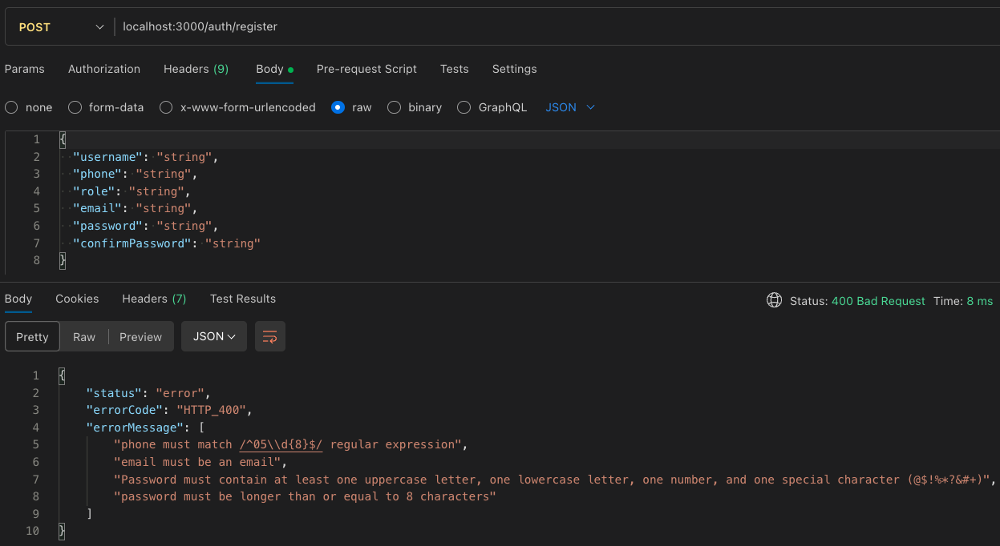

# Nest.js Template Project

This is a Nest.js project that incorporates several technologies, including Swagger for API documentation, TypeORM with SQL database for data storage, Node Mailer for sending emails, and JWT for authentication.

## Description

This project is built using Nest.js, a powerful framework for building scalable and efficient server-side applications with TypeScript. It combines various technologies to provide a robust foundation for a template application, allowing you to focus on building your business logic with ease.

## Features

- **Swagger API Documentation**: The API endpoints are documented using Swagger. The API documentation provides detailed information about each endpoint, making it easier for developers to understand and use the API.

- **TypeORM with SQL Database**: TypeORM is used as the Object-Relational Mapping (ORM) tool to interact with the SQL database. It provides a seamless integration with Nest.js, allowing you to define database models and perform CRUD operations with ease.

- **Node Mailer**: The project utilizes Node Mailer to send emails. You can easily configure and send transactional emails, such as welcome emails, password reset emails, and more.

- **Authentication with JWT**: JWT (JSON Web Tokens) is employed for user authentication. It provides a secure way to authenticate users and manage user sessions without the need for server-side storage.

## Requirements

Before running the project, ensure you have the following dependencies installed:

- node.js (v=18+)
- npm     (v=10+)
- docker

## Installation


1. Install the dependencies:

```bash
npm install
```

2.  Run local Db:

```bash
docker-compose up -d
```

3. Generate migration and Run it:

```bash
npm run migration-generate && npm run migration-run
```

## Usage

To start the server, use the following command:

```bash
  npm run start:dev
```

The server will be running at `http://localhost:3000` by default. You can now access the API endpoints and test the functionalities.

## API Documentation

The API endpoints are documented using Swagger. To access the API documentation, navigate to `http://localhost:3000/api-docs` in your browser. The Swagger UI will display the available endpoints along with their descriptions and request/response details.

## Authentication

The project uses JWT for user authentication. To access protected routes, clients need to include the JWT token in the `Authorization` header of the request. The server will verify the token, and if valid, grant access to the protected resources.

To generate a JWT token, make a `POST` request to the `/auth/login` endpoint with valid user credentials. The server will respond with a JWT token that can be used for subsequent authenticated requests.

## Email Notifications

Node Mailer is integrated into the project to send emails. You can use the provided email service to send transactional emails to users. To configure the email service, update the email credentials in the `.env` file.

## License

This project is licensed under the [MIT License](LICENSE). Feel free to use and modify the code to suit your needs.

---

## Screenshot Examples

### Data type validation out-of-the-box
